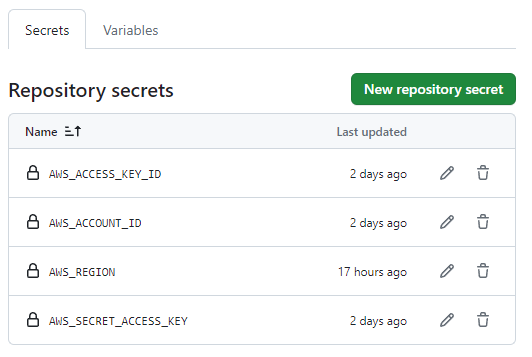
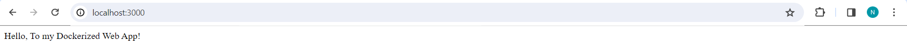

<!-- **ECS-Deployment**  -->
---
---
# **Overview** -
The goal of the ECS Deployment project is to use AWS Elastic Container Service (ECS) to deploy containerised applications more efficiently. The project automates the development of ECS clusters using Infrastructure as Code (IaC) with Terraform and AWS. Dockerizing an example web application and using GitHub Copilot to generate code snippets relevant to ECS are important aspects. Using GitHub Actions, a solid CI/CD pipeline is set up that is in accordance with contemporary DevOps methodologies to automate the deployment of Dockerized apps on ECS and guarantee a smooth workflow from development to production.

# **Prerequisites** -
1. AWS Elastic Container Service (ECS): Automated ECS cluster creation using Terraform for Infrastructure as Code (IaC).

2. Dockerized Web Application: Containerization of a sample web application (e.g., Node.js, Python) for efficient deployment.

3. GitHub Copilot Integration: Utilization of GitHub Copilot to generate code snippets for ECS-related configurations, promoting consistency and reducing manual effort.

4. CI/CD Pipeline with GitHub Actions: Implementation of a CI/CD pipeline using GitHub Actions to automate the deployment of the Dockerized app to ECS

# **Getting Started** -
1. Clone the repository 
2. Write Terraform configuration
3. Create a Sample Web App
4. Create a Dockerfile - Build and push docker image
5. Set Up CI/CD Pipeline with GitHub Actions
6. Set up GitHub Secrets 

# **Configuration** - 
## **AWS credentials** -
1. Access AWS Console
2. Create IAM User
3. Get Access Key and Secret Access Key

## **GitHub secrets** -
1. Navigate to Repository Settings
2. Add New Secrets

3. Configure Terraform
 
# **Usage ** - screenshots
1. Running the Project Locally 
   - Clone the repository
   - Navigate to the project directory
   - Install dependencies
   - Configure AWS credentials
   - Run the project
2. Github actions 
3. Interacting with the application

# **Issue - GitHub Actions Configuration Errors **
1. GitHub Actions Documentation: Review the GitHub Actions documentation to understand workflow syntax and best practices.
2. Online Resources: Utilize online resources, and YouTube tutorials, to find solutions to common GitHub Actions issues.

# **Contributing** - 
1. Contribute code by submitting a pull request.
I appreciate your contributions, making the ECS Deployment project better for everyone!

# **License** - 
BSD 2-Clause License

BSD 2-Clause License

Copyright (c) [2024], [Noor]

Redistribution and use in source and binary forms, with or without
modification, are permitted provided that the following conditions are met:

1. Redistributions of source code must retain the above copyright notice, this
   list of conditions, and the following disclaimer.

2. Redistributions in binary form must reproduce the above copyright notice,
   this list of conditions, and the following disclaimer in the documentation
   and/or other materials provided with the distribution.

THIS SOFTWARE IS PROVIDED BY THE COPYRIGHT HOLDERS AND CONTRIBUTORS "AS IS"
AND ANY EXPRESS OR IMPLIED WARRANTIES, INCLUDING, BUT NOT LIMITED TO, THE
IMPLIED WARRANTIES OF MERCHANTABILITY AND FITNESS FOR A PARTICULAR PURPOSE ARE
DISCLAIMED. IN NO EVENT SHALL THE COPYRIGHT HOLDER OR CONTRIBUTORS BE LIABLE
FOR ANY DIRECT, INDIRECT, INCIDENTAL, SPECIAL, EXEMPLARY, OR CONSEQUENTIAL
DAMAGES (INCLUDING, BUT NOT LIMITED TO, PROCUREMENT OF SUBSTITUTE GOODS OR
SERVICES; LOSS OF USE, DATA, OR PROFITS; OR BUSINESS INTERRUPTION) HOWEVER
CAUSED AND ON ANY THEORY OF LIABILITY, WHETHER IN CONTRACT, STRICT LIABILITY,
OR TORT (INCLUDING NEGLIGENCE OR OTHERWISE) ARISING IN ANY WAY OUT OF THE USE
OF THIS SOFTWARE, EVEN IF ADVISED OF THE POSSIBILITY OF SUCH DAMAGE.

# Keywords - 
- AWS ECS
- Terraform
- Docker
- GitHub Actions
- CI/CD
- DevOps
- GitHub Copilot

Thank you for taking the time to explore my project and read through this README. I appreciate your interest and hope you find it helpful!